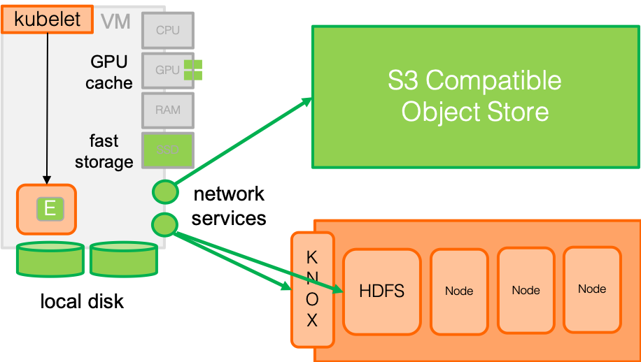
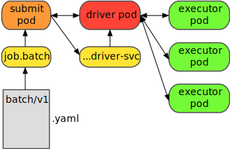

# Using Spark and S3 on Kubernetes

With Kubernetes-native Spark we no longer need YARN or a dedicated Spark
cluster to run workloads. Instead, we can run Spark on Kubernetes (K8S) using
K8S as the cluster and orchestrator of resources. This allows compute and
memory requests for drivers and workers to be amortized across the K8S cluster.

The remaining question is about how to access data from the various
"executor" pods:



While it is possible to access HDFS from within workloads running on K8S, the
executor pods require direct access to the named node. This may be an issue
in some contexts as the Hadoop cluster is partitioned behind a networking
"walled garden"; direct access is forbidden.

Meanwhile, on the cloud and on-premise, S3-compatible storage is also an option.
Using S3 from within Spark is possible and has different performance characteristics.
Yet, doing so is simple and only requires having a build of Spark that is
both K8S aware and packaged with the supporting S3 libraries.

Sometimes it is a struggle to get all the parts and version aligned just so and
this is certainly the case with running Spark natively on Kubernetes along with
S3 support. To help ease this struggle, this project includes some documentation
and examples of packaging and using Spark with "S3 protocol" support.

The following instructions will step you through the process of building or
acquiring an K8S+S3 compatible Spark distribution, packaged as a container
image, and demonstrations of how to use it.

## 1. Assessing Your Requirements

### Spark Version

Kubernetes (K8S) support was introduced in Spark 2.3 and pyspark support on K8S
was added in Spark 2.4 along with many other useful features for K8S. Your
best option is to use Spark 2.4 or later.

If you need a version of Spark before 2.3, you should consider other options
(e.g., YARN or a standalone cluster). This is essentially because of the way
that Spark uses ports for talking to workers (i.e., picking random ports) is
problematic for Kubernetes. You can make it work but it requires managing
a layer of networking, possibly outside of K8S, and that really defeats the
purpose of using K8S in the first place.

### Hadoop Version

You must use Hadoop version 2.8.0 or later for the AWS S3 library support to
work properly. Various dependencies on jar files in the 2.8.0 distribution
were introduced via the libraries that support S3 access. If you need to use a
Hadoop version before 2.8.0, you are likely unable to access S3 resources via
urls within Spark computations.

The good news here is that if you are only going to access data from S3, then
the version of Hadoop doesn't really matter (except possibly to your code). It
will never talk to HDFS or other Hadoop systems except internally within
the Spark distribution you packaged in the container imager.


## 2. Acquiring Spark

You need to acquire the right version of Spark with S3 support.

### Checking a Distribution

If your spark distribution has been packaged with AWS S3 support, you should
see files like:

```
jars/hadoop-aws-2.9.2.jar
jars/aws-java-sdk-bundle-1.11.199.jar
```

The Hadoop AWS integration is suffixed with the Hadoop version number and
the AWS SDK is suffixed with a version is own versioning label.

### Building from Source

You can also build your own distribution from source. One easy way to obtain
a source distribution is via [spark releases](https://github.com/apache/spark/releases)
on github. Just download a version subsequent to Spark 2.3 (the minimum for Kubenetes
support).

Once you have unpacked a source distribution, you can build a binary distribution
locally via:

```bash
./dev/make-distribution.sh --name hadoop-2.9 --pip --tgz -Phadoop-2.9 -Pyarn -Pkubernetes -Phadoop-cloud -Dhadoop.version=2.9.2
```

In the above command:

 * The `--name` parameter controls the suffix used to name the distribution
 * The `-Dhadoop.version=n.n.n` needs to match the target Hadoop version (2.8.0+)

The outcome should be a file in the source directory named `spark-{version}-bin-{name}.tgz`
where `version` is the Spark version and `name` is what you specified for the
`--name` parameter of `make-distribution.sh`.

You can unpack this binary distribution of Spark anywhere you need.

## 3. Building Base Container Images

Kubernetes uses container images and so you need to package both your code and
spark into a container image. We'll use the scripts within the Spark
binary distribution to build base images that can be used to package your
spark code.

In the `kubernetes/dockerfiles/spark` directory of the distribution you will
find dockerfiles for building two images:

 * a generic image for JVM-based languages
 * an image for pyspark and Python support

In the following commands, we'll use the following environment variables that
you should customize to your image owner (i.e., container registry user) and
version labels:

```bash
export OWNER=alexmilowski
export SPARK_VERSION=2.4.1
export HADOOP_VERSION=2.9.2
export IMAGE_VERSION=1
```

You can then build both images via the following two commands (from the root
of the binary distribution):

```bash
docker build -t ${OWNER}/s3-spark:${SPARK_VERSION}-${HADOOP_VERSION}-${IMAGE_VERSION} --no-cache -f kubernetes/dockerfiles/spark/Dockerfile .
docker build -t ${OWNER}/s3-pyspark:${SPARK_VERSION}-${HADOOP_VERSION}-${IMAGE_VERSION} --no-cache -f kubernetes/dockerfiles/spark/bindings/python/Dockerfile --build-arg base_img=alexmilowski/s3-spark:${SPARK_VERSION}-${HADOOP_VERSION}-${IMAGE_VERSION} .
```

## 4. Testing S3 Access

You can test the container images by building a test container image:

```bash
docker build -t ${OWNER}/s3-spark-test:${SPARK_VERSION}-${HADOOP_VERSION}-${IMAGE_VERSION} --no-cache -f test/access/Dockerfile --build-arg base_img=${OWNER}/s3-pyspark:${SPARK_VERSION}-${HADOOP_VERSION}-${IMAGE_VERSION} .
```

This test allows for the following options:

 * `--endpoint` The S3 endpoint (defaults to AWS)
 * `--access-key` The S3 access key
 * `--secret-key` The S3 secret key

and then a set of `s3a://bucket/...` URLs.

For example:

```bash
export ENDPOINT=...
export ACCESS_KEY=...
export SECRET_KEY=...
docker run -it ${OWNER}/s3-spark-test:${SPARK_VERSION}-${HADOOP_VERSION}-${IMAGE_VERSION} /opt/spark/bin/spark-submit --master local /app/test_access.py --endpoint ${ENDPOINT} --access-key ${ACCESS_KEY} --secret-key ${SECRET_KEY} url ...
```

If you've run `aws configure`, you can try this:

```bash
docker run -it ${OWNER}/s3-spark-test:${SPARK_VERSION}-${HADOOP_VERSION}-${IMAGE_VERSION} /opt/spark/bin/spark-submit --master local /app/test_access.py --access-key `grep aws_access_key_id ~/.aws/credentials | awk '{print $3}'` --secret-key "`grep aws_secret_access_key ~/.aws/credentials | awk '{print $3}'`" s3a://amazon-reviews-pds/tsv/amazon_reviews_us_Digital_Video_Download_v1_00.tsv.gz
```

## 5. Build the Amazon example

To demonstrate the K8S+S3 support, we'll package a simple example that uses an AWS S3 open data set. The [Amazon Customer Reviews Dataset](https://registry.opendata.aws/amazon-reviews/) contains over a 130+ million customer review. The various files vary in size but the default is the `amazon_reviews_us_Digital_Video_Download_v1_00.tsv.gz` file which is ~ 0.5GB in size and sufficient for testing access.

Build the example image via:

```bash
export TEST_VERSION=1
docker build -t ${OWNER}/s3-spark-amazon-reviews:${SPARK_VERSION}-${HADOOP_VERSION}-${TEST_VERSION} --no-cache -f examples/amazon-reviews/Dockerfile --build-arg base_img=${OWNER}/s3-pyspark:${SPARK_VERSION}-${HADOOP_VERSION}-${IMAGE_VERSION} .
```

Make sure you configure your AWS access (only once):

```bash
aws configure
```

Finally, test the container:

```bash
docker run -it ${OWNER}/s3-spark-amazon-reviews:${SPARK_VERSION}-${HADOOP_VERSION}-${TEST_VERSION} /opt/spark/bin/spark-submit --master local /app/simple_read.py --access-key `grep aws_access_key_id ~/.aws/credentials | awk '{print $3}'` --secret-key "`grep aws_secret_access_key ~/.aws/credentials | awk '{print $3}'`"
```

## 6. Running Spark via K8S

A spark job can be created by submitting a batch job that will run the
`spark-submit` command. This will create the driver and executor pods and
serve as a place from which you can monitor the job logs.



The batch job creates a pod that runs the spark-submit command. The spark-submit creates the driver and driver service from which the executors are creates to carry out various computational tasks. From the perspective of the user, you create a single YAML file that describes batch job for the spark-submit and the rest happens automatically. See [Running Spark on Kubernetes](http://spark.apache.org/docs/latest/running-on-kubernetes.html) for more details.

### A Brief Description of the Example

In `examples/amazon-reviews/batch.yaml`, the batch job uses the
container image that was previously built. The `spark-submit` commands uses the following options:

 * `spark.kubernetes.container.image`: A reference to the same container image used in the batch job (all the code is in the same image)
 * `spark.kubernetes.driver.secretKeyRef`: The secret references for the S3 access and secret keys for the driver pods.
 * `spark.kubernetes.executor.secretKeyRef`: The secret references for the S3 access and secret keys for the executor pods.
 * `spark.executor.instances`: We artificially limit the executors to one instance because the example is small. This limit is optional.

The example just does a simple select of 10 rows of the data via Spark SQL.


### Setup a Namespace

My recommendation is to setup a namespace to run your computations. In this
example, we'll call this `spark-test`:

```bash
export NAMESPACE=spark-test
kubectl create namespace $NAMESPACE
```

Second, we'll need to setup a service account in that namespace in which
the spark jobs will run. This service account needs to have the ability to
create the driver and executor pods. You should be careful to limit this
privilege to the namespace.

This can be done for a `spark` service account as follows:

```bash
kubectl apply -f examples/amazon-reviews/setup.yaml
```

### Configure your Credentials

In this example, we'll store the AWS keys in a secret called `aws-secrets` with
tTo do so, we'll extract
them from your AWS configuration (e.g., from `~/.aws/credentials`):

```bash
export AWS_ACCESS_KEY_ID_BASE64=`grep aws_access_key_id ~/.aws/credentials | awk '{print $3}' | base64`
export AWS_SECRET_ACCESS_KEY_BASE64=`grep aws_secret_access_key ~/.aws/credentials | awk '{print $3}' | base64`
```

Then expand the AWS keys in your config map in the namespace:

```bash
./template.sh examples/amazon-reviews/aws-secrets.yaml | kubectl create -f -
```

Feel free to create the

### Submit the Job

Finally, expand the batch template to create the test spark-submit job with
the image labels:
```bash
./template.sh examples/amazon-reviews/batch.yaml | kubectl create -f -
```

You can view the logs for the simple_read.py test via:

```bash
kubectl logs job.batch/simple-read
```

### Inspect the Results

When you inspect the namespaces via `kubectl get all`, you should see something like:

```
NAME                                  READY   STATUS        RESTARTS   AGE
pod/simple-read-gd4lf                 0/1     Completed     0          47s
pod/simpleread-1555621371351-driver   0/1     Completed     0          39s
pod/simpleread-1555621371351-exec-1   0/1     Terminating   0          27s

NAME                                          TYPE        CLUSTER-IP   EXTERNAL-IP   PORT(S)             AGE
service/simpleread-1555621371351-driver-svc   ClusterIP   None         <none>        7078/TCP,7079/TCP   39s

NAME                    DESIRED   SUCCESSFUL   AGE
job.batch/simple-read   1         1            49s
```

When the batch job shows a `1` under `SUCCESSFUL`, the job has completed. You can then inspect the logs via the `service/simpleread...-driver-svc` service:

```
kubectl logs service/simpleread-1555621371351-driver-svc
```

In that log you should see something like:
```
+-----------+-----------+--------------+----------+--------------+--------------------+--------------------+-----------+-------------+-----------+----+-----------------+--------------------+--------------------+-----------+
|marketplace|customer_id|     review_id|product_id|product_parent|       product_title|    product_category|star_rating|helpful_votes|total_votes|vine|verified_purchase|     review_headline|         review_body|review_date|
+-----------+-----------+--------------+----------+--------------+--------------------+--------------------+-----------+-------------+-----------+----+-----------------+--------------------+--------------------+-----------+
|         US|   12190288|R3FU16928EP5TC|B00AYB1482|     668895143|Enlightened: Seas...|Digital_Video_Dow...|          5|            0|          0|   N|                Y|I loved it and I ...|I loved it and I ...| 2015-08-31|
|         US|   30549954|R1IZHHS1MH3AQ4|B00KQD28OM|     246219280|             Vicious|Digital_Video_Dow...|          5|            0|          0|   N|                Y|As always it seem...|As always it seem...| 2015-08-31|
|         US|   52895410| R52R85WC6TIAH|B01489L5LQ|     534732318|         After Words|Digital_Video_Dow...|          4|           17|         18|   N|                Y|      Charming movie|This movie isn't ...| 2015-08-31|
|         US|   27072354| R7HOOYTVIB0DS|B008LOVIIK|     239012694|Masterpiece: Insp...|Digital_Video_Dow...|          5|            0|          0|   N|                Y|          Five Stars|excellant this is...| 2015-08-31|
|         US|   26939022|R1XQ2N5CDOZGNX|B0094LZMT0|     535858974|   On The Waterfront|Digital_Video_Dow...|          5|            0|          0|   N|                Y|Brilliant film fr...|Brilliant film fr...| 2015-08-31|
|         US|    4772040|R1HCST57W334KN|B0112OSOQE|      38517795|Rick and Morty Se...|Digital_Video_Dow...|          5|            5|          6|   N|                Y|Best show on TV r...|If you don't like...| 2015-08-31|
|         US|   12910040|R32BUTYQS1ZJBQ|B000NPE5SA|     373323715|      Africa Screams|Digital_Video_Dow...|          4|            1|          1|   N|                Y|Very funny. A typ...|Very funny.  A ty...| 2015-08-31|
|         US|   38805573|  RH4SXPL4L9QU|B00XWV4QXG|     633842417| Entourage: Season 7|Digital_Video_Dow...|          3|            0|          0|   N|                Y|it was not as goo...|Strange as it is,...| 2015-08-31|
|         US|   37100714|R37INWIQA5YW8N|B00X8UKOUK|     666093513|Catastrophe - Sea...|Digital_Video_Dow...|          2|            0|          0|   N|                Y|           Two Stars|Funny shows! We l...| 2015-08-31|
|         US|   41234409|R18GSVAAS3N8GX|B00OOKXTFU|     801680808|The Worricker Tri...|Digital_Video_Dow...|          3|            0|          0|   N|                Y|        A tad Stuffy|Well made. Great ...| 2015-08-31|
+-----------+-----------+--------------+----------+--------------+--------------------+--------------------+-----------+-------------+-----------+----+-----------------+--------------------+--------------------+-----------+

```
